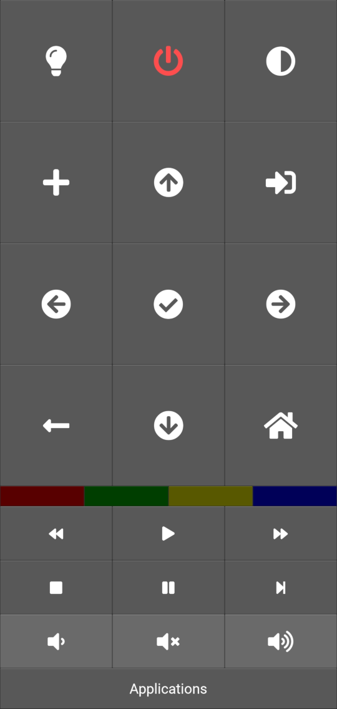
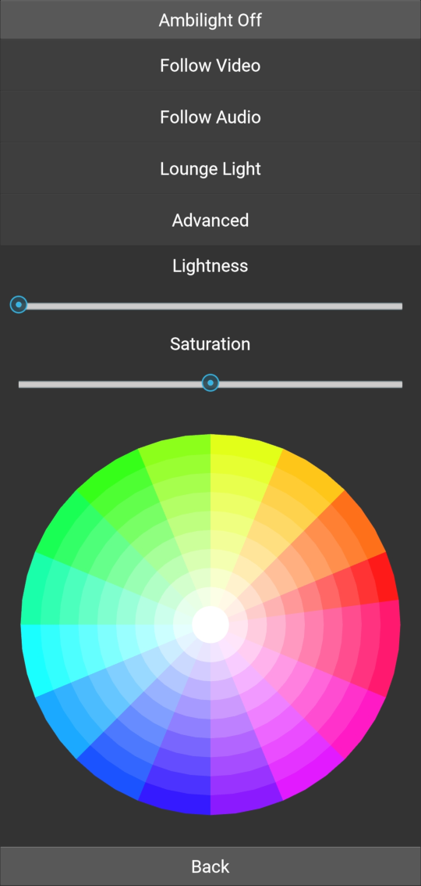
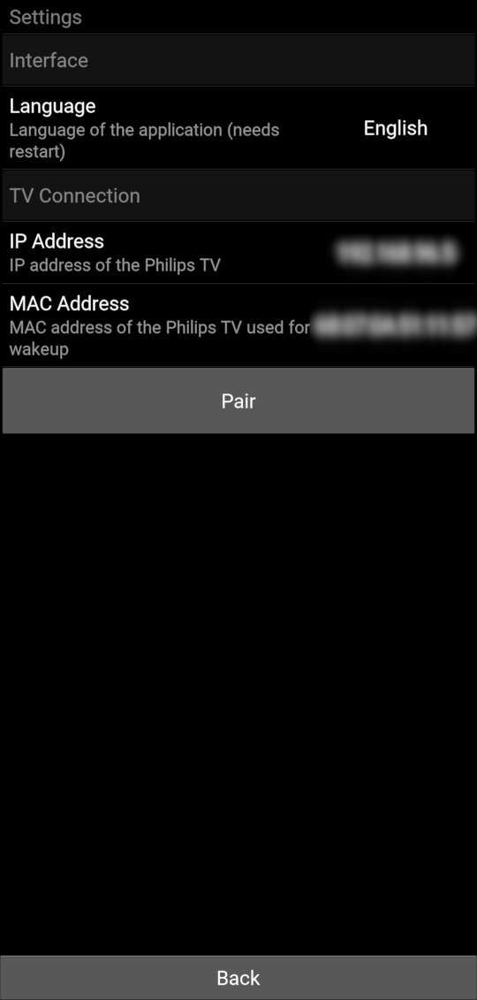

# PhilipsTV Kivy Remote

Simple Philips AndroidTV that suits my needs.

## Description

This is an application providing remote control to Philips Android TV. It looks like this.

The remote does not have any keys associated with watching TV as it is intended to control smart features and watching streaming services. If this is a problem for you, just file an issue.

## Getting Started

### Dependencies

* Python 3.6 or higher
* [Kivy](https://kivy.org)

### Executing program

On desktop simply run `main.py`.

### Pairing your TV

The program does not discover your TV automatically. You need to specify its IP manually.

First, open settings on your TV and select `Wireless and Networks` > `Wired of Wi-Fi` > `View network settings`. Note the IP address
of your TV.  Next, hold the source button 
for 2 seconds to open settings. Then enter the IP of the TV in the appropriate box and click **`Pair`** button to pair the app
with your TV.

### Usage

Just use the buttons on remote. Generally they match the ones on your remote. Holding some of the buttons for 2 seconds will provide
additional action:

| Button                                                                             | Long-Press Action               |
| ---------------------------------------------------------------------------------- | ------------------------------- |
|   | Open app settings               |
|          | Show *Quick Settings* on the TV |
|  |  |

Pressing  opens Ambilight control menu, in which
you can choose one of the presets or select a custom color and you can adjust Ambilight lightness and saturation.

 button provides quick access to the image settings.

## Android APK build

In order to build Android package, you can use [Buildozer](https://github.com/kivy/buildozer). Simply type
`buildozer android debug` to build the package. Then connect your phone, activate ADB and type `buildozer android deploy`
to send the package to your phone.

## Author

Maciej Dems <macdems@gmail.com>

## License

This project is licensed under the MIT License - see the [LICENSE.md](LICENSE.md) file for details

## Acknowledgments

Inspiration, code snippets and Philips API are reproduced form [Pylips](https://github.com/eslavnov/pylips) library by Evgeny
Slavnov. In part its extensive Philips API description was very helpful.

This application uses [FontAwesome](https://fontawesome.com/license/free).
